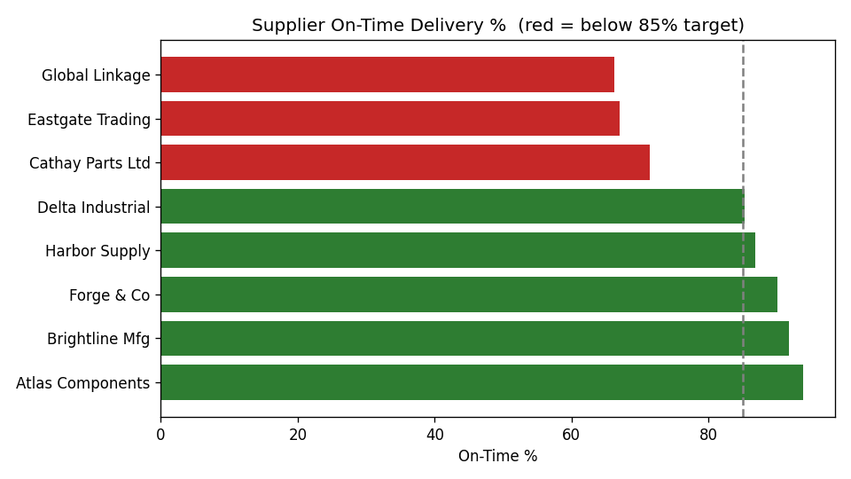
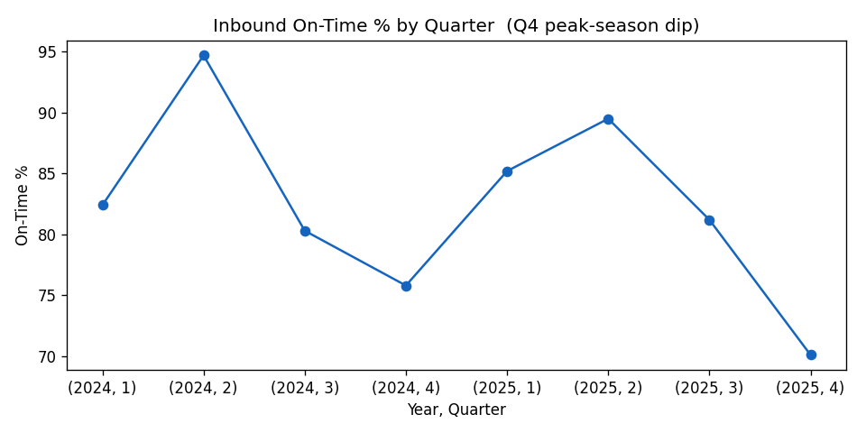

# 📦 Supply Chain Analytics — Northbound Supply Co.

**An end-to-end analytics project: data modeling → SQL → Python → visualization.**
Built around a fictional consumer-hardware distributor running 4 regional
distribution centers. The data is synthetic but realistic, with deliberate
operational problems hidden inside for the analysis to surface.

> **Why this project exists:** to demonstrate the full data-analyst workflow on a
> business domain (supply chain / logistics) using the same star-schema +
> SQL + Python toolset behind the Power BI and IBM Data Analyst certifications.

---

## 🎯 The business questions

1. **Which suppliers can we trust?** (on-time delivery, fill rate, quality)
2. **Does peak season (Q4) break our inbound supply?**
3. **What's our perfect-order rate** — the composite quality metric?
4. **Where is inventory at risk of stocking out?**
5. **Carriers: what's the cost-vs-speed trade-off** on outbound shipments?
6. **Where is freight cost leaking** relative to goods value?

---

## 📊 Headline findings

| KPI | Result | So what? |
|---|---|---|
| **Perfect-order rate** | **68.7%** | ~1 in 3 inbound POs has a defect, delay, or shortfall. |
| **Best suppliers** | Atlas (93.8%), Brightline (91.8%) — US | Reliable, near-zero rejects. Anchor volume here. |
| **Worst suppliers** | Global Linkage (66%), Eastgate (67%) — offshore | Late *and* highest reject % (1.0–1.9%). Renegotiate or dual-source. |
| **Seasonality** | Q4 on-time drops to ~46–52% vs ~65–70% off-peak | Peak season is the single biggest reliability risk. |
| **Stockout risk** | **Fasteners** family below reorder point **60% of months** | High-velocity, under-stocked — needs higher safety stock. |
| **Carrier trade-off** | AirFast = 82% on-time @ $0.45/unit vs GroundCo 77% @ $0.21/unit | 2× freight cost buys only ~5 pts on-time — reserve air for priority SKUs. |




---

## 🗂️ Data model (star schema)

```
                ┌──────────────┐
                │   dim_date   │
                └──────┬───────┘
                       │
┌───────────────┐   ┌──┴────────────────────┐   ┌────────────────┐
│ dim_supplier  ├───┤ fact_purchase_orders  ├───┤  dim_product   │
└───────────────┘   │      (inbound)        │   └───────┬────────┘
                    └───────────────────────┘           │
┌───────────────┐   ┌───────────────────────┐           │
│ dim_warehouse ├───┤    fact_shipments     ├───────────┤
└──────┬────────┘   │     (outbound)        │           │
       │            └───────────────────────┘           │
       │            ┌───────────────────────────┐       │
       └────────────┤ fact_inventory_snapshot   ├───────┘
                    │   (month-end on-hand)     │
                    └───────────────────────────┘
```

**4 dimensions + 3 fact tables:**

| Table | Grain | Rows | Key columns |
|---|---|---|---|
| `dim_date` | one row / day (2024–2025) | 731 | DateKey, IsPeakSeason |
| `dim_supplier` | one row / supplier | 8 | ReliabilityScore, DefectRate |
| `dim_product` | one row / SKU | 15 | Family, UnitCost, GrossMarginPct |
| `dim_warehouse` | one row / DC | 4 | Region |
| `fact_purchase_orders` | one row / inbound PO | ~600 | OnTimeFlag, DaysLate, QtyRejected |
| `fact_shipments` | one row / outbound shipment | ~3,700 | Carrier, OnTimeFlag, TransitDays |
| `fact_inventory_snapshot` | one row / month × WH × SKU | 1,440 | OnHandQty, BelowReorderFlag |

---

## ▶️ How to run it

```bash
# 1. Generate the data (pure Python stdlib — no install needed, fully seeded)
python3 generate_data.py

# 2. Load it into SQLite (sqlite3 ships with macOS)
sqlite3 supplychain.db < load_sqlite.sql

# 3a. Run the SQL KPI pack
sqlite3 supplychain.db < analysis.sql

# 3b. Run the Python analysis + generate charts
python3 -m venv .venv && .venv/bin/pip install -r requirements.txt
.venv/bin/python analysis.py        # writes charts/*.png
```

> The data is generated with a fixed random seed (42), so everyone who runs it
> gets identical numbers — important for a reproducible portfolio piece.

---

## 🧰 Skills demonstrated

- **Data modeling** — star schema, fact/dimension separation, surrogate keys, grain
- **SQL** — joins, aggregation, `CASE` logic, composite KPIs, window-free ranking
- **Python** — pandas group-by/merge, KPI engineering, matplotlib charting
- **Supply-chain domain** — OTD, fill rate, perfect-order, inventory turnover,
  days-below-reorder, landed cost, carrier cost-vs-service analysis
- **Reproducibility** — seeded synthetic data, headless chart generation, venv

---

## 📁 Files

| File | What it is |
|---|---|
| `generate_data.py` | Synthetic data generator (stdlib, seeded) |
| `load_sqlite.sql` | Schema + CSV import into SQLite |
| `analysis.sql` | 7-query KPI pack with business-question comments |
| `analysis.py` | pandas analysis + 4 charts |
| `data/*.csv` | The generated star-schema tables |
| `charts/*.png` | Output visualizations |
| `requirements.txt` | pandas, matplotlib |

---

## 💡 Possible extensions (next iterations)

- Add a **reorder-point optimization** (safety stock = z·σ·√lead-time).
- Build a **Power BI dashboard** on these CSVs (fits Sessions 07–08 of this workspace).
- Add a **supplier risk score** combining OTD, reject %, and lead-time variance.
- Forecast **Q4 demand** and pre-position inventory for the peak.

---

*Synthetic data for portfolio/educational use. "Northbound Supply Co." is fictional.*
